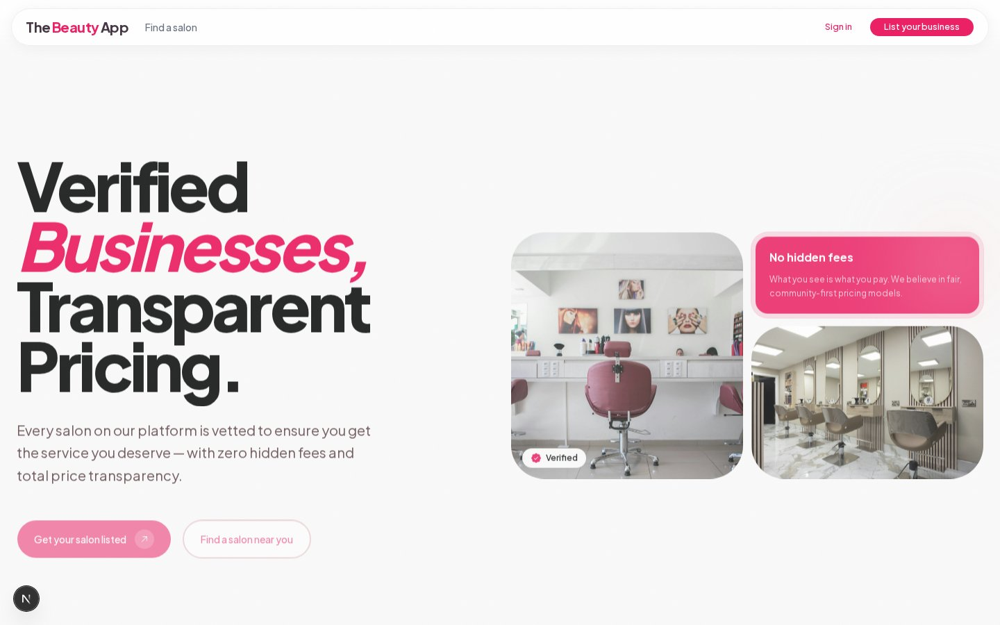
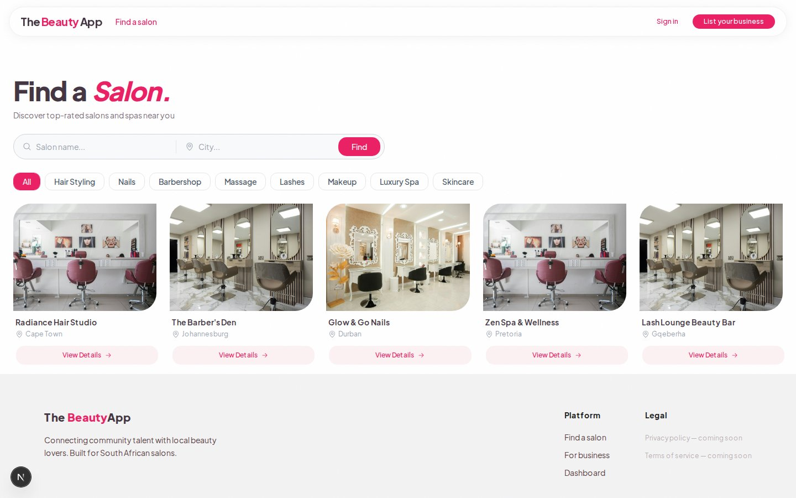
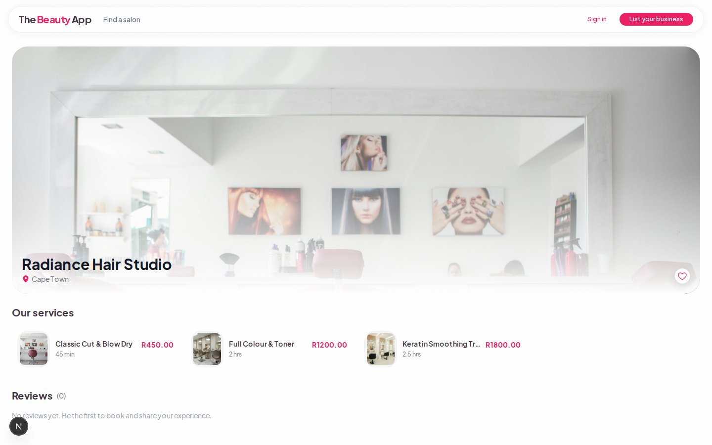
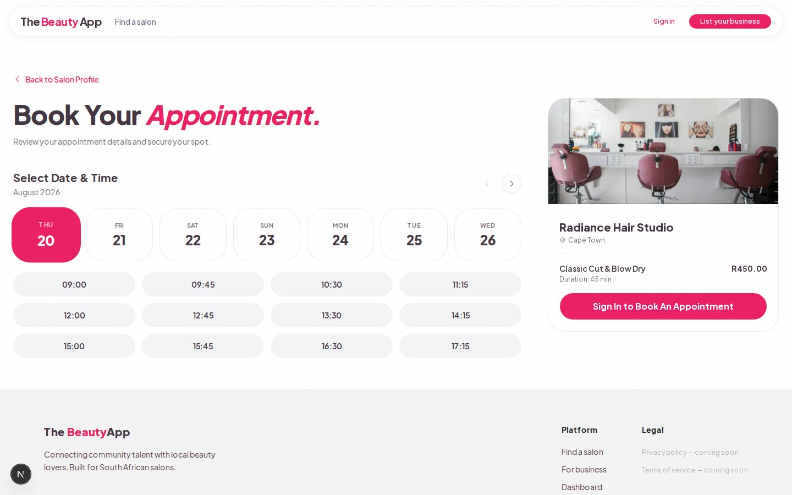
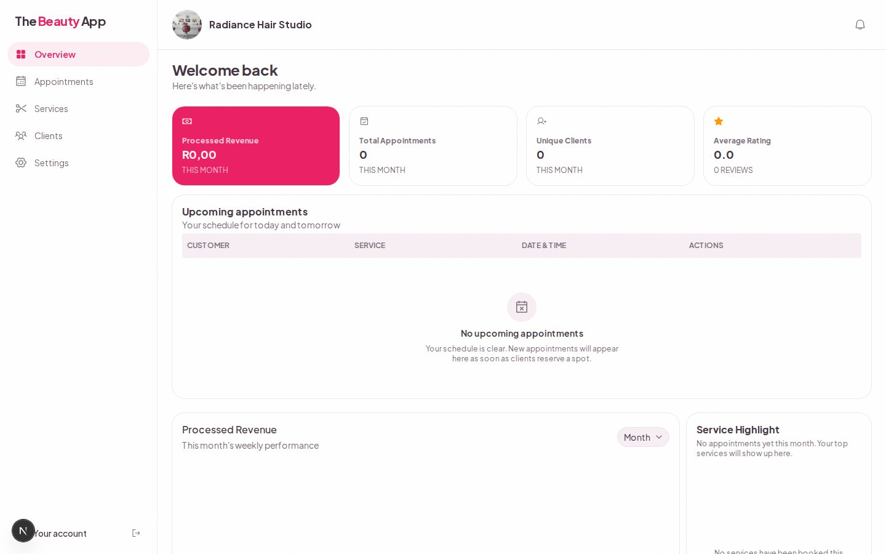
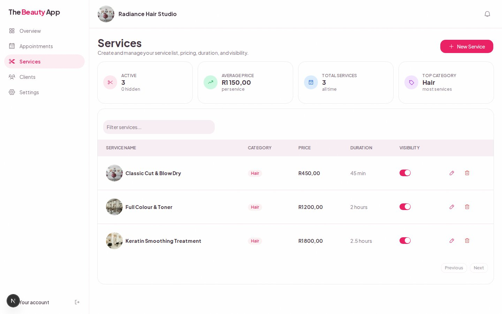

# Beauty App — Go Server Edition

**Live demo:** https://demo.thebeautyapp.co.za

A salon discovery and booking platform: customers find salons, view services, and book
appointments; salon owners onboard their business, manage services/hours/pricing, and
track bookings from a dashboard.

This repo is a full backend migration of that product — the same frontend, rebuilt on a
**self-built Go REST API** instead of Convex + Clerk.

## Why this exists

The original version of this app (linked below) uses Convex as a backend-as-a-service
and Clerk for auth — a good choice for shipping fast on someone else's infrastructure.
This version exists to demonstrate the other half of the skill set: designing and
building that infrastructure myself — schema design, migrations, auth, and a REST API,
rather than consuming one.

**Sister repo (Convex + Clerk version):** https://github.com/Jiexi-Ash/beauty-app

| | This repo | Sister repo |
|---|---|---|
| Backend | Custom Go REST API | Convex (BaaS) |
| Database | PostgreSQL (raw SQL, hand-written migrations) | Convex's document store |
| Auth | Self-issued JWT + refresh-token cookie | Clerk |
| File uploads | S3 presigned URLs | Convex file storage |
| Frontend | Same Next.js app, rewired to a REST API | Next.js + Convex React hooks |

Same product, two different backend philosophies — this repo is the "build it yourself"
half of that pair.

## Screenshots

| | |
|---|---|
|  |  |
| Home | Explore salons |
|  |  |
| Salon profile | Booking — real slot availability, computed server-side in the salon's own timezone |
|  |  |
| Owner dashboard overview | Service management — pricing, duration, visibility toggle |

All screenshots are of the live app against the running Go API and seeded demo data —
nothing mocked.

## Architecture

```
beauty-app/   Next.js 16 (App Router) frontend
              — Route handlers under app/api/* proxy the browser to the Go API,
                relaying the httpOnly refresh cookie and short-lived JWT access token.
              — React Query is the sole data layer (no Convex hooks/subscriptions).

server/       Go REST API (server/go-api) + docker-compose for local Postgres
              — net/http (stdlib ServeMux), no framework
              — sqlc-generated, type-safe queries over PostgreSQL
              — goose for versioned SQL migrations
              — argon2id password hashing, JWT (HS256) access tokens + rotating
                refresh tokens stored in the DB
              — AWS S3 presigned URLs for salon/service cover image uploads
```

Auth flow: the browser never talks to the Go API directly. Next.js route handlers
(`app/api/auth/*`, `app/api/go/*`) forward requests to the Go API and relay its
`Set-Cookie` header for the refresh token, keeping it httpOnly and inaccessible to
client JS.

## Tech stack

- **Frontend:** Next.js 16, React 19, TanStack Query, TanStack Form + Zod, Tailwind,
  Radix/shadcn-style UI components
- **Backend:** Go 1.26, pgx/v5, sqlc, goose migrations, AWS SDK v2 (S3)
- **Database:** PostgreSQL 18
- **Infra (local dev):** Docker Compose (Postgres + Go API containers)

## Running it locally

### Prerequisites

- Node.js 20+ and npm
- Docker + Docker Compose
- A Google Maps API key (Places autocomplete + geocoding during onboarding)
- An AWS S3 bucket + credentials (cover image uploads) — optional to get the app
  running, but service activation requires a cover image, so uploads won't work
  without it

### 1. Start the backend

```bash
cd server
cp .env.example .env   # fill in DATABASE_URL, JWT_SECRET, POSTGRES_*, GOOGLE_MAPS_API_KEY,
                        # and the S3_* / AWS_* keys
docker compose up -d
```

This starts Postgres (port `5433` on the host) and the Go API (port `8080`).

Run migrations against the running Postgres container:

```bash
cd go-api
goose postgres "postgresql://<POSTGRES_USER>:<POSTGRES_PASSWORD>@localhost:5433/<POSTGRES_DB>?sslmode=disable" up
```

(Requires the [goose CLI](https://github.com/pressly/goose) installed locally, or run it
via `docker run` — see `server/ReadMe.md` for the container-network connection string.)

### 2. Start the frontend

```bash
cd beauty-app
cp .env.local.example .env.local   # GO_API_URL=http://localhost:8080, plus NEXT_PUBLIC_S3_CF_DISTRO
npm install
npm run dev
```

Open http://localhost:3000. Register an account, onboard a salon (owner flow) or
browse `/explore` (customer flow).

## What's stubbed / not built out

Being upfront about scope, since this is a portfolio piece rather than a shipped
product: payments (Paystack) integration, in-app notifications, service deletion,
salon gallery images, and staff scheduling all have Go API groundwork in places but
no complete frontend flow — the UI either hides them or shows a visible "coming soon"
state rather than pretending they work. Everything else (auth, onboarding, salon
publish/visibility, service management with image uploads, business hours, the full
booking flow with timezone-aware slot computation, reviews, favorites, and the owner
dashboard) is real, wired end-to-end against the live Go API, and manually verified.
